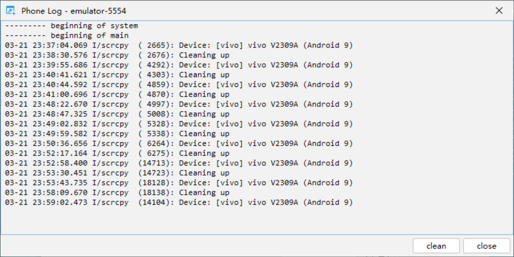
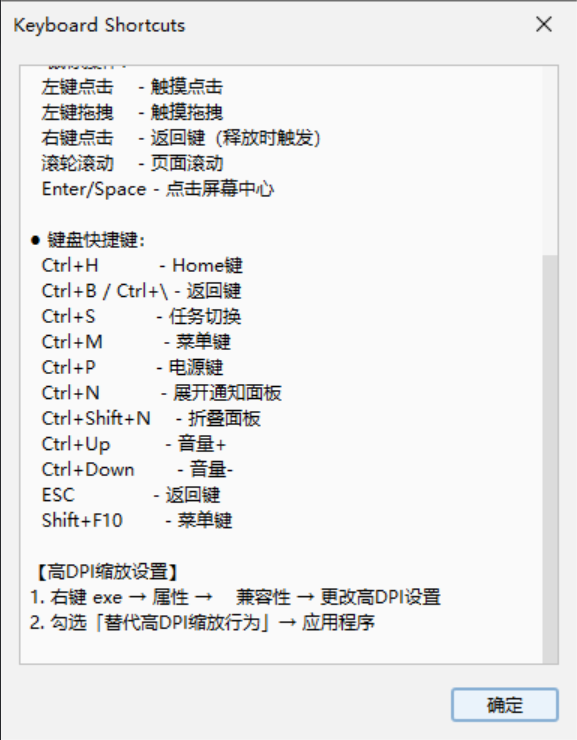
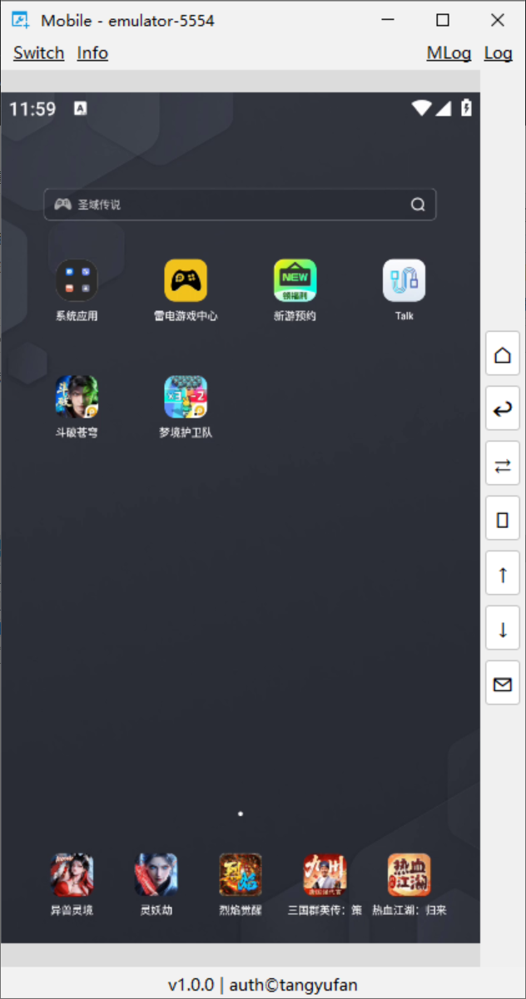
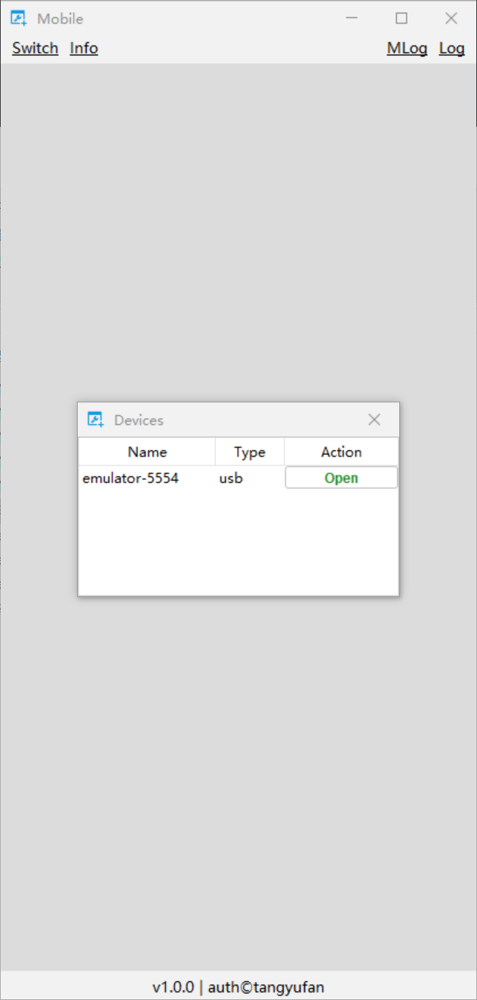

# Mobile - Android Phone Remote Control

## 功能描述

Mobile 是一款 Android 手机远程控制桌面应用，通过 USB 或 WiFi 连接手机，将手机屏幕实时投射到电脑并支持双向控制。

<table border="1">
  <tr>
    <th></th>
    <th></th>
    <th></th>
    <th></th>
  </tr>
</table>

### 核心功能

- **实时投屏**：将 Android 设备屏幕实时投射到电脑，支持横竖屏自动适配
- **双向控制**：在电脑上操作手机，支持点击、拖拽、滚轮滑动等交互
- **快捷控制**：提供虚拟按键快速执行 Home、返回、任务切换、电源等操作
- **设备管理**：支持多设备切换，可通过 WiFi 或 USB 连接不同手机
- **日志查看**：支持查看手机端 scrcpy 服务日志，便于问题排查

---

## 键位映射说明

### 鼠标操作

| 鼠标操作 | 功能 |
|---------|------|
| 左键点击 | 触摸点击 |
| 左键拖拽 | 触摸拖拽 |
| 右键点击 | 返回键（释放时触发） |
| 滚轮滚动 | 页面滚动 |
| Enter / Space | 点击屏幕中心 |

### 键盘快捷键

| 快捷键 | 功能 |
|-------|------|
| Ctrl + H | Home 键 - 返回主屏幕 |
| Ctrl + B / Ctrl + \ | 返回键 |
| Ctrl + S | 任务切换 |
| Ctrl + M | 菜单键 |
| Ctrl + P | 电源键 |
| Ctrl + N | 展开通知面板 |
| Ctrl + Shift + N | 折叠面板 |
| Ctrl + ↑ | 音量+ |
| Ctrl + ↓ | 音量- |
| ESC | 返回键 |
| Shift + F10 | 菜单键 |

---

## 实体键说明

应用右侧提供侧边快捷按钮面板，连接设备后自动显示：

| 按钮 | 功能 |
|-----|------|
| ⎰ | Home - 返回主屏幕 |
| ⇩ | Back - 返回键 |
| ⇄ | Switch - 任务切换 |
| ⏻ | Power - 电源键 |
| ↑ | Vol+ - 音量增加 |
| ↓ | Vol- - 音量减少 |
| ✉ | Notify - 展开通知面板 |

---

## 点击动效说明

应用支持点击反馈动画效果：

- **动画类型**：模拟器风格的点击涟漪效果
- **触发条件**：在手机画面上进行左键点击操作
- **视觉效果**：白色半透明圆形从点击位置向外扩散并逐渐消失
- **动画时长**：约 0.25 秒
